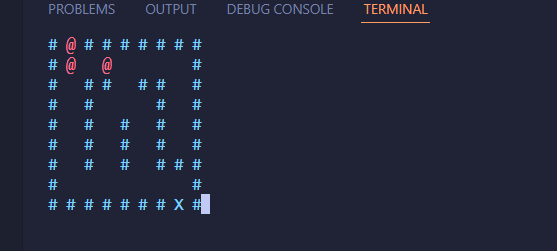

# Shortest_Path_Finder_using_BFS-python
This is a Maze completion program which finds the Shortest Path to complete the maze and  display the progress on Terminal, It is  Basic yet simple Program to dive in Python and learn about DSA
 
Here's the Images how the Code will look while executing: 

 
# After Completion: 

  
# On Windows use: 
-->pip install -r requirements.txt

# To run the Program use: 
---> python shortest_path_finder.py
